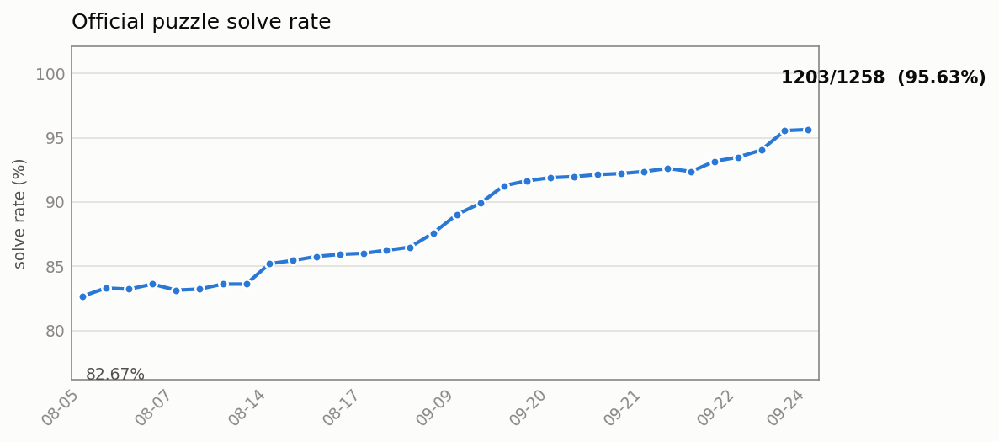

# SolverOfTheArtisanOfGlimmith

《格里米斯的工匠》(The Artisan of Glimmith) 谜题求解器与编辑器。

谜题核心目标：把矩形网格划分为多个连通区域，使得**所有区域内外的线索条件**（单元格 / 边 / 顶点 / 全局）都得到满足。共 **22 条规则**（见 [规则支持](#规则支持)）。

## 目录

- [快速开始](#快速开始)
- [求解能力与官方题库](#求解能力与官方题库)
- [静态网站](#静态网站)
- [求解器架构](#求解器架构)
- [规则支持](#规则支持)
- [参考项目](#参考项目)
- [文档索引](#文档索引)
- [开发](#开发)

## 快速开始

```bash
cd rsolver && cargo build --release   # 构建 Rust 求解器（默认路由必需）
python src/app.py                     # Qt UI (PySide6)
python -m pytest tests/ -x --tb=short # 全量测试 (~290 个)
python scripts/benchmark_rust_solver.py --timeout 30  # 验证全部谜题 (每题 30s 超时)
python scripts/benchmark_rust_solver.py  # 官方题基准（每题 20s 超时）
```

> `benchmark_rust_solver.py`（含全量 verify 模式）会对每个解出的**官方题**额外比对
> `*-answer` 目录的**官方唯一解**：解合法但与官方解分区不同会标记 `DIFF` 并计入失败
> （官方解唯一性准则）。非官方谜题（reference / user / aiGen）无官方解，跳过该比对。

> `default_router()` 会急切构造 `RustSolver`，因此运行 app 与 `benchmark_rust_solver.py` 之前必须先 `cargo build --release`（二进制在 `rsolver/target/release/rsolver`）。

## 求解能力与官方题库

官方谜题（`puzzles/official`，1258 题）求解进度，每次 `main` 提交由 CI 全量重跑、自动更新：




> 曲线纵轴为缩放后的求解率区间（非 0–100），以突出小幅变化。数据源 `docs/solver-history.json`
> （历史点由 `docs/official-puzzles-status.md` 里程碑表解析，此后由 CI 追加）；交互版见
> [GitHub Pages `/trend/`](https://betaller.github.io/SolverOfTheArtisanOfGlimmith/trend/)。

- **CI 流程**（[`.github/workflows/benchmark.yml`](.github/workflows/benchmark.yml)）：`main` 提交 →
  `cargo build --release` → 全量 `benchmark_rust_solver.py --timeout 40 -j 8 --adaptive-j` →
  解析「结果: X/Y 通过」→ 追加 `docs/solver-history.json` → 重绘 PNG 与 `/trend/` 页 → `[skip ci]` 提交回 `main`。
- **详细进度 / DIFF / UNSOLVED / 软门禁**：见 [`docs/official-puzzles-status.md`](docs/official-puzzles-status.md)。
  官方解是唯一解；对求解器 / 转换 / 校验 / 规则语义的每次优化，须按该文档附录 D 与 `CLAUDE.md`
  的软门禁同步文档，并把基准结果归档入库（`results/bench/…`、`results/bin/…`）。

## 静态网站

浏览器内求解器：`rsolver`（Rust）编译为 WebAssembly，在 Web Worker 中运行；前端 Vue 3 +
TypeScript + Vite + Pinia。纯静态站点，由 GitHub Pages 托管：

- **在线地址**：<https://betaller.github.io/SolverOfTheArtisanOfGlimmith/>
- **求解趋势页**：[`/trend/`](https://betaller.github.io/SolverOfTheArtisanOfGlimmith/trend/)
- **求解策略**：官方题直接渲染 `*-answer` 官方解（**不调用求解器**）；无官方解的题 / 用户自建题
  交给 WASM 求解器（浏览器默认 5s 超时）。
- **部署**：[`.github/workflows/deploy.yml`](.github/workflows/deploy.yml) 在 push 到 `main` 时
  构建 `web/dist` 并发布到 Pages（站点根）；`web/public/trend/` 随站点部署到 `/trend/`。
- **本地构建 / 开发**：见 [`web/README.md`](web/README.md)。

> 已知边界（MVP）：画板目前是只读渲染（官方题浏览 + 求解），规则 / 边 / 顶点的交互编辑尚未实现。

## 求解器架构

**Rust 求解器**（`rsolver/`）是唯一求解引擎。Python 侧（`src/solver/`）只保留路由接口与
规则/形状共享层——曾经的 Python 求解算法（精确覆盖 / 玫瑰窗 / 回溯）已在 2026-08-06 移除
（全语料评估证明它们解不出 Rust 引擎解不出的题，见 `docs/official-puzzles-status.md` §C.0）。

### 路由策略（Python 侧）

`SolverRouter`（`src/solver/base.py`）当前只挂 RustSolver：

```
RustSolver
```

**关键不变量**：路由器对求解器的答案都经 `IndependentValidator`
（`src/validation/validator.py`）独立重验证，与求解器内部规则检查解耦。答案错误会被拦截并
记为失败——任何求解器 bug 都不可能把错误解"走私"出来。

### Rust 求解器（`rsolver/`）

子进程协议：谜题 JSON → stdin，题解 JSON → stdout（`rsolver --batch` 支持多行输入逐行输出，
`RustSolver.solve_batch` 复用一个子进程批量求解）。内部按顺序尝试多个算法，先出答案者胜：

```
① AoG DFS（主力，C++ 参考求解器的 1:1 移植 + 剪枝）→ ② Rose（纯玫瑰窗）
→ ③ edge_csp（边变量 CSP）→ ④ Pieces/DLX（形状池 / 面积 / 罗盘 → 精确覆盖）
→ ⑤ Backtrack（逐区域 DFS，兜底）
```

aog 求解器内部检查视为权威（`build_solution_trusted`），Rust 侧不再重验证；rose/pieces/
backtrack 的答案须过 `solver/validate.rs` 验收门。每个题解 JSON 带 `solver` 字段标出
答案出自哪个模块（`aog` / `rose` / `edge_csp` / `pieces` / `backtrack`），
`benchmark_rust_solver.py` 以 `via=...` 输出，便于把结果归到具体求解器。

### 目录结构

```
src/solver/               Python 接口与共享层
├── base.py                Solver ABC + SolverRouter 路由层（Rust-only）
├── rust_solver.py         Rust 子进程封装（block→形状池转换等）
├── constraints.py         22 条规则校验器（UI / 校验共用）
├── shapes.py              多联骨牌变换、规范化（UI / 脚本共用）
└── exceptions.py          求解异常

rsolver/src/               Rust 求解器
├── main.rs / mod.rs       入口 + 路由调度
├── solver/
│   ├── aog/               AoG DFS（C++ 移植）
│   ├── rose/              玫瑰窗（cells / region_match / rose_growth）
│   ├── edge_csp/          边变量 CSP（三态边 + 不动点传播）
│   ├── pieces.rs + dlx.rs 精确覆盖
│   └── backtrack.rs       区域回溯
└── constraints.rs / types.rs / grid.rs / polyomino.rs
```

## 规则支持

全部 22 条规则均已实现。

| 规则 | 中文 | 类型 | 支持 |
|------|------|------|:--:|
| shape_pool | 形状池 | 全局 | ✅ 精确覆盖 + 回溯 |
| rose_window | 玫瑰窗 | 单元格 | ✅ 专用求解器 + 回溯 |
| heterogeneous | 异生 | 边 | ✅ |
| homogeneous | 双生 | 边 | ✅ |
| precise | 精确 | 全局 | ✅ 精确覆盖 + 回溯 |
| puzzle_piece | 拼块 | 单元格 | ✅ |
| mixed | 混合 | 全局 | ✅ |
| area | 面积 | 单元格 | ✅ |
| same | 相同 | 全局 | ✅ |
| range | 范围 | 全局 | ✅ |
| fence | 围栏 | 单元格 | ✅ |
| different | 相异 | 全局 | ✅ |
| solitary | 独居 | 全局 | ✅ |
| block | 方块 | 全局 | ✅ 精确覆盖 + 回溯 |
| non_block | 非方块 | 全局 | ✅ |
| differentiation | 差异化 | 全局 | ✅ |
| brick | 砖纹 | 全局 | ✅ |
| ring | 环纹 | 全局 | ✅ |
| inequality | 不等号 | 边 | ✅ 弧一致性传播 |
| difference | 差值 | 边 | ✅ 弧一致性传播 |
| watchtower | 望塔 | 顶点 | ✅ |
| compass | 罗盘 | 单元格 | ✅ |

每条规则在 Rust 各求解器中的具体实现见 `docs/rust-solver/03-规则与代码映射.md`。

### 已知限制

| 限制 | 说明 |
|------|------|
| 网格尺寸 | 2×2 ~ 16×16 |
| 罗盘 + 无尺寸约束 | 没有 precise/range/shape_pool 限定区域大小时，搜索空间大 |
| 独居 + 无尺寸约束 | 同上，需先枚举全部候选再精确覆盖 |
| 超大网格精确覆盖 | 11×11 以上形状池候选数可能超 10 万，超时 |
| 复杂组合 | compass / rose / ring 强规则组合剪枝不足，仍有个别题解不出 |
| 预定义分割线 + 玫瑰窗 | 复杂预切玫瑰窗题耗时较长 |

## 参考项目

| 仓库 | 语言 | 借鉴 |
|------|------|------|
| Neptune17/AoG_Solver | C++ | 多级种子选择、组件可行性剪枝 |
| lifthrasiir/aog | Rust | DLX 舞蹈链、不等式弧一致性、多求解器架构 |
| shartiniquais/glimmith-solver | JS | 精确覆盖 + 候选过滤模式 |
| hhhxiao/TAGSolver | Python | 相同形状并行增长 |
| acasperw/shape-helper | TS | 形状可视化 |

## 文档索引

| 文档 | 内容 |
|------|------|
| `docs/architecture.md` | Python 侧架构设计 |
| `docs/rules-guide.md` | 22 条规则详解与解题技巧 |
| `docs/official-puzzles-status.md` | 官方题库求解进度 / DIFF / UNSOLVED / 软门禁 |
| `docs/rust-solver/README.md` | Rust 求解器源码详解系列（01-09，含算法流程图、数据结构图、规则映射表） |
| `docs/testing.md` / `docs/faq.md` | 测试指南 / 常见问题 |
| `CLAUDE.md` | 对 Claude Code 的仓库指引（含文档软门禁） |

## 开发

```bash
ruff check src/ tests/    # lint (line-length=100)
ruff format src/ tests/   # format
mypy src/                 # typecheck (strict)
cd rsolver && cargo test  # Rust 测试
```
